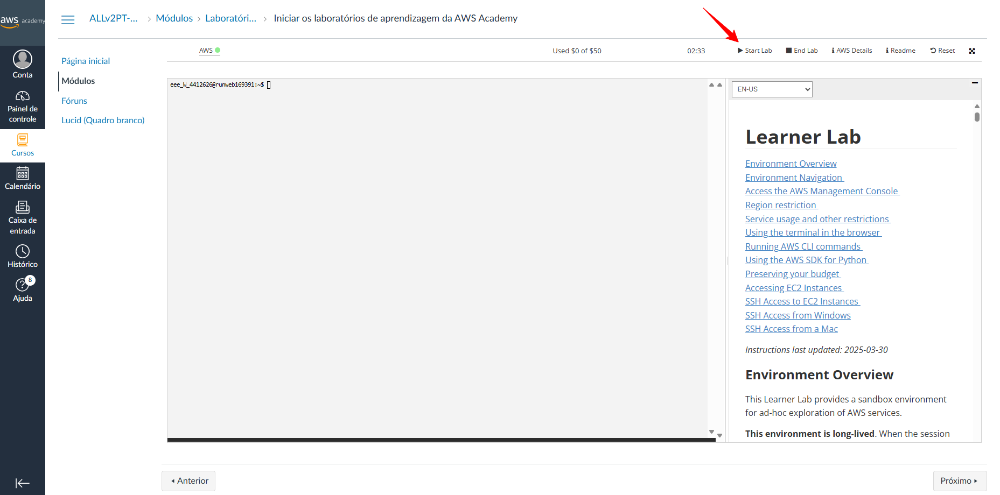
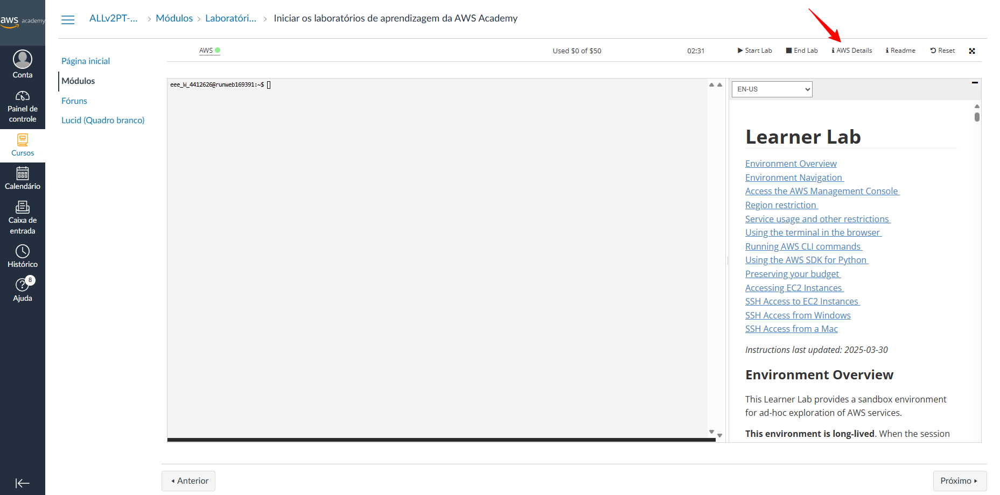
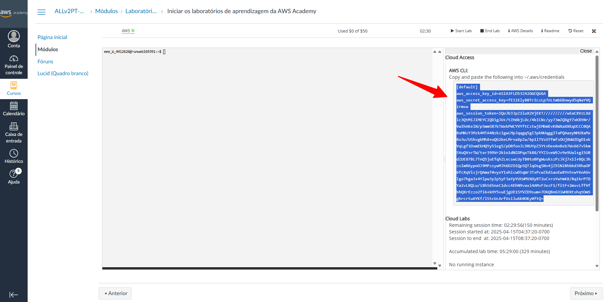
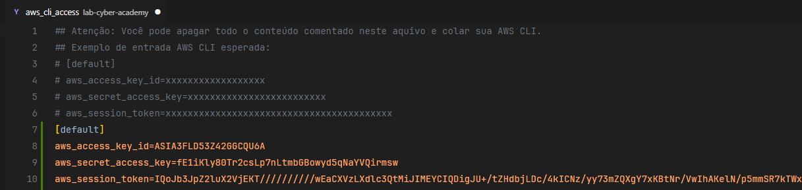
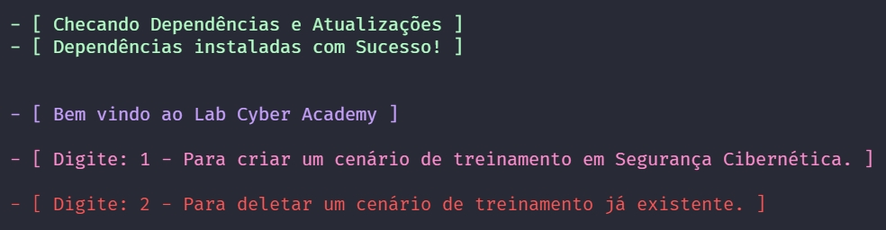
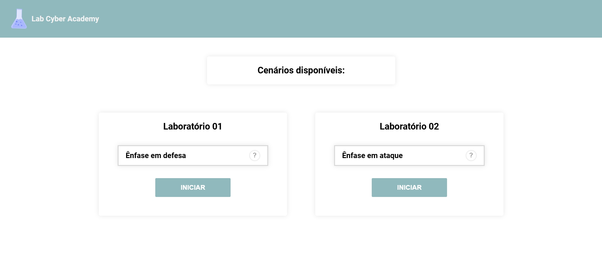
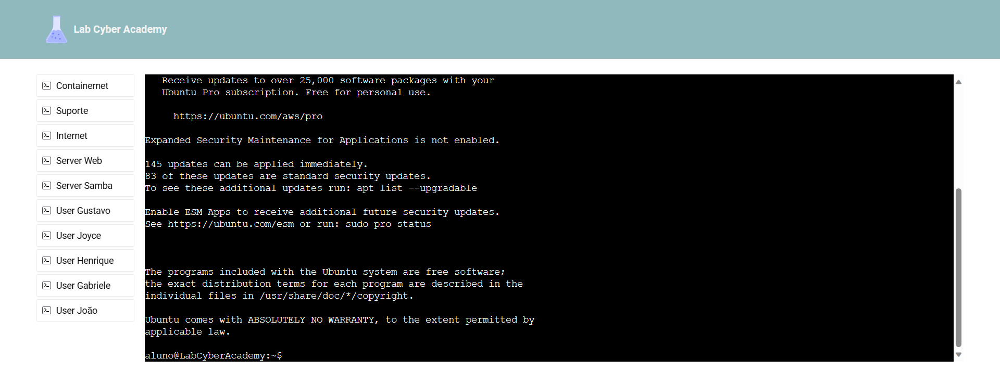
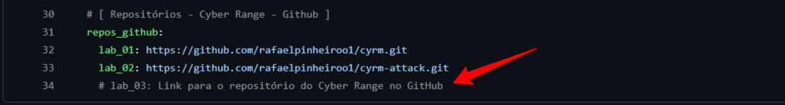
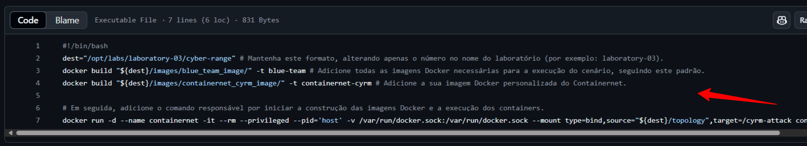

# ⚗️ Lab Cyber Academy 🧪
<br>

O objetivo deste projeto é propor, de forma automatizada, a criação de laboratórios de pesquisa e estudo na área de Cibersegurança, utilizando Cyber Range em containers Docker em plataformas na nuvem. Com isso, através de uma aplicação combinada com métodos de Infraestrutura como Código, proponho automatizar e facilitar a criação da infraestrutura necessária para a criação dos laboratórios em instâncias EC2.

---
<br>
<br>

<div align="center"></img></div>

<br>
<br>

> #### 🎯 Nota: É importante destacar que siga todas as instruções abaixo, para que não ocorra nenhum tipo de problema.

---

<br>

## 🔎 Pré-requisitos:
<br>

```sh
✏️ 1° Requisito - Tenha acesso a uma conta AWS Academy;

✏️ 2° Requisito - Tenha acesso a um terminal Linux com permissão de super usuário.
```

---

<br>

## ⚙️ Instalação e Execução:
<br>

**✏️ 1° Passo** - Clone este repositório em sua máquina local utilizando o comando abaixo no seu terminal:
```sh
git clone https://github.com/vitorreiel/lab-cyber-academy.git
```
<br>
<br>

**✏️ 2° Passo** - Agora, em seu navegador, acesse sua AWS Academy e inicie seu Lab. Para iniciar seu Lab, basta clicar na opção:
```sh
Start Lab
```



<br>
<br>

**✏️ 3° Passo** - Ainda em sua AWS Academy, clique na opção "AWS Details".



Feito isso, procure a informação "AWS CLI" e em seguida, clique na opção "Show". Com isso, copie toda sua AWS CLI, pois ela será usada posteriormente. Abaixo um exemplo de como seria uma AWS CLI:
```sh
[default] 
aws_access_key_id=xxxxxxxxxxxxxxxxxx 
aws_secret_access_key=xxxxxxxxxxxxxxxxxxxxxxxxx 
aws_session_token=xxxxxxxxxxxxxxxxxxxxxxxxxxxxxxxxxxxxxxxxx
```



<br>
<br>

**✏️ 4° Passo** - Retorne para o terminal de sua máquina local e entre no repositório "lab-cyber-academy". Feito isso, utilize o editor de texto de sua preferência para editar o arquivo "aws_cli_access". Com isso, cole sua AWS CLI copiada no passo anterior. Abaixo um exemplo de como entrar no repositório e editar o arquivo aws_cli_access:
```sh
cd lab-cyber-academy
nano aws_cli_access
```



>  🎯 **Nota:** Se desejar, você pode apagar todo o conteúdo comentado no arquivo "aws_cli_access" e depois colar sua AWS CLI. Como também, pode apenas colar na útlima linha do arquivo. Fica a sua escolha.
<br>
<br>

**✏️ 5° Passo** - Execute o script para iniciar o processo de instalação dos componentes necessários. Em seguida, será solicitado ao usuário que digite o valor (1 ou 2), para iniciar o processo de provisionamento ou destruição de um ambiente já existente. Abaixo o comando de execução do script:
```sh
./playbook.sh
```

>  🎯 **Nota:** Complementando, após a execução do script (playbook.sh), o usuário deverá inserir um valor no terminal: (1) para provisionar um ambiente de treinamento do zero ou (2) para remover um ambiente já existente em sua AWS Academy. Abaixo, a figura ilustra essa solicitação de entrada:

   <p align="center">
      
   </p>

<br>
<br>

**✏️ 6° Passo** - Após o processo de provisionamento mencionado no passo anterior, será disponibilizado ao usuário, ao final do provisionamento, o link para acesso à interface da plataforma. Uma tela semelhante a esta deverá ser exibida:

   <p align="center">
      
   </p>

>  🎯 **Nota:** O usuário deve selecionar o laborátorio de sua preferência e aguardar até que o ambiente sejá criado.

<br>
<br>

**✏️ 7° Passo** - Por fim, o usuário terá acesso ao cenário carregado, no qual os nós são representados por botões que podem ser alternados com um simples clique. A cada alteração, o nó selecionado é destacado e a CLI do componente correspondente também é ajustada. Abaixo, uma imagem de exemplo do cenário Blue Team:

   <p align="center">
      
   </p>

>  🎯 **Nota:** Para prosseguir com o treinamento, o usuário deve executar e responder às questões de um questionário guiado para cada cenário disponível. Há duas formas de acessá-lo: o arquivo .XML de cada cenário, disponível no repositório na pasta "moodle", pode ser importado para sua plataforma Moodle, permitindo a realização do questionário diretamente nela. Alternativamente, o usuário pode utilizar a versão em .PDF, também presente na pasta "moodle", e conferir suas respostas no final do arquivo.

---

<br>

## 💾 Material de Apoio:

<br>

✏️ Abaixo, um vídeo disponível no YouTube mostra, com mais detalhes, o processo de instalação e execução da ferramenta:

* [Link no Youtube](https://youtu.be/N25Jo9__HgI?si=bWRNxNcTFlYBwEcl)

---

<br>

## 💾 Como implantar um novo Cyber Range no Lab Cyber Academy (LCA)?

Para adicionar novos cenários, é necessário seguir a estrutura de configuração já definida por nossa solução. Para facilitar esse processo, disponibilizamos alguns templates e comentários nos pontos exatos onde as alterações devem ser realizadas. Além disso, os novos cenários também devem ser integrados à interface da aplicação, conforme descrito na documentação disponível no README do repositório: [⚗️ Lab Cyber Academy App 🧪](https://github.com/vitorreiel/lab-cyber-academy-app).

<br>

**✏️ 1° Passo** - Adicione o link do repositório GitHub contendo o seu projeto Cyber Range no arquivo de configuração localizado em: `playbook-ansible/vars/main.yml`. Certifique-se de seguir o padrão comentado e exemplificado na imagem abaixo.



**✏️ 2° Passo** - Inicialmente, crie uma pasta dentro de `playbook-ansible/utils/` para acomodar a instalação das dependências do seu laboratório. É importante seguir o padrão de nomenclatura da estrutura (por exemplo: laboratory-03) e não utilizar nomes arbitrários.  

Além disso, crie um script nomeado como `start-lab.sh` dentro dessa pasta.  

Por fim, conceda permissão de execução ao script utilizando o seguinte comando:

```
chmod +x start-lab.sh
```

**✏️ 3° Passo** - Adicione todas as imagens Docker e configurações necessárias que devem ser instaladas na instância responsável por executar o laboratório no script recém-criado: `start-lab.sh`.  

Abaixo, apresentamos uma imagem de exemplo:



**✏️ 4° Passo** - Verifique se todos os passos foram devidamente seguidos e se a estrutura está conforme o padrão estabelecido. Em seguida, prossiga com as alterações no repositório da interface da aplicação para finalizar a integração.

---

<br>

#### 🎯 Nota: Este repositório é utilizada em conjunto ao [⚗️ Lab Cyber Academy App 🧪](https://github.com/vitorreiel/lab-cyber-academy-app).

---

<br>

<div style="display: inline_block;">

   

</div>
<div style="display: inline_block;">
   
   
   
   
   
   
   
   
</div>
